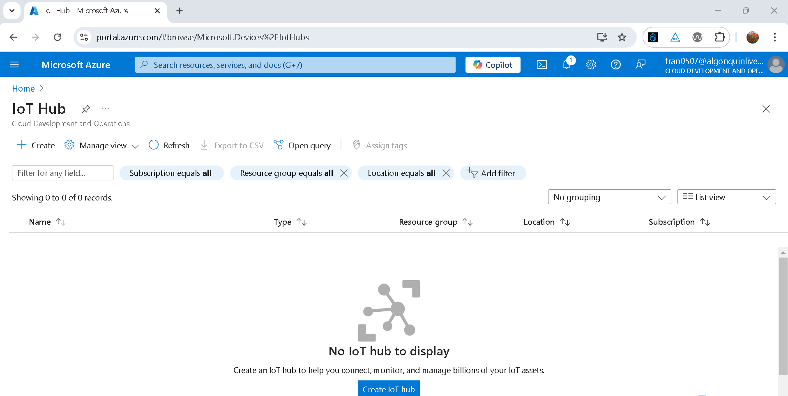
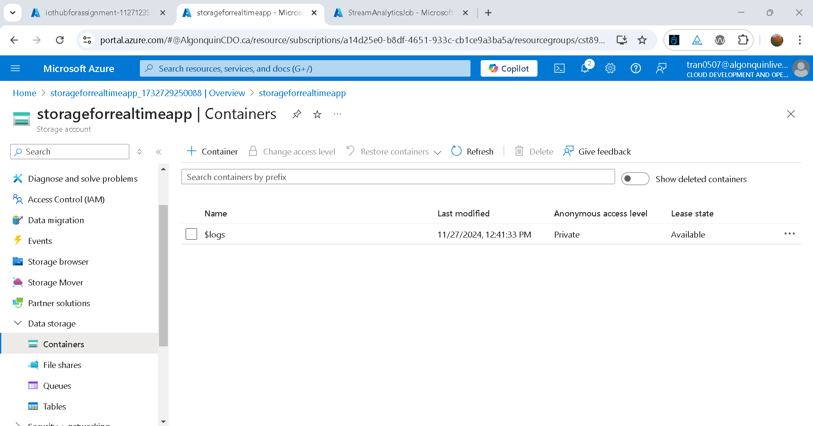

# Real-time Monitoring System for Rideau Canal Skateway
## Scenario Description

The Rideau Canal Skateway, a historic and world-renowned attraction in Ottawa, needs constant monitoring to ensure skater safety. In this project, we will help the National Capital Commission (NCC) to build a real-time data streaming system that will:

* Simulate IoT sensors to monitor ice conditions and weather factors along the canal.
* Process incoming sensor data to detect unsafe conditions in real time.
* Store the results in Azure Blob Storage for further analysis.

## Step 1: Azure set up
First, we create a resource group:


Second of all, we create an IoThub:

   

Thirdly, we create the IoTHub devices:

      

After that, we create the storage account:

  

We also create a storage container for our results:

  


Here we set up Azure Stream Analytics:

   

## Step 2: Write the simulation Python Scripts and queries for Azure stream analytics

On premise, we prepare a python script for Azure

``` py
import time
import random
from azure.iot.device import IoTHubDeviceClient, Message
from datetime import datetime
import json

def get_telemetry(location):
    return {
        'location': location,
        'iceThickness': random.uniform(20.0, 40.0),
        'surfaceTemperature': random.uniform(-10, 30),
        'snowAccumulation': random.uniform(0, 10),
        'externalTemperature': random.uniform(-10.0, 30.0),
        'timestamp': time.time(),
    }
    
def create_client(connection_string):
    return IoTHubDeviceClient.create_from_connection_string(connection_string)
    
def send_message_azure(client, location):
    telemetry = get_telemetry(location)
    message = Message(str(telemetry))
    client.send_message(message)
    print(f'Sent message: {message}')
    
if __name__ == '__main__':
    print('Sending telemetry to IoT Hub...')
    client1 = create_client('HostName=iothubforassignment.azure-devices.net;DeviceId=Device1;SharedAccessKey=urkO3O+R6tYV0yWCz7wbiDujmzrN28TvY45GjKa1WL8=')
    client2 = create_client('HostName=iothubforassignment.azure-devices.net;DeviceId=Device2;SharedAccessKey=m/GFhWL4YC3TJAIkcYJxNtq/K1dXjUDJhum+cXIVIP8=')
    client3 = create_client('HostName=iothubforassignment.azure-devices.net;DeviceId=Device3;SharedAccessKey=+yNyXihxJTwwqOmjqdc9TUcyDbHkuMWqm+tOc/50hwU=')
    try:
        while True:
            send_message_azure(client1, 'Dow\'s Lake')
            send_message_azure(client2, 'Fifth Avenue')
            send_message_azure(client3, 'NAC')
            time.sleep(10)
    except KeyboardInterrupt:
        print('Stopped sending messages.')
    finally:
        client1.disconnect()
        client2.disconnect()
        client3.disconnect()
```
How to run the python scripts:

We install the needed packages to run the script. The most important library to run this script is IoTHubDeviceClient:

``` pip install -r requirements.txt ```

After that, since we have the connection string, the script will run and produce the sensor similation code for the IoT sensor.

Here is our queries for our stream analytics 
```
SELECT
    IoTHub.ConnectionDeviceId AS DeviceId,
    AVG(temperature) AS AvgTemperature,
    AVG(humidity) AS AvgHumidity,
    AVG(iceThickness) AS AvgIceThickness,
    AVG(surfaceTemperature) AS AvgSurfaceTemperature,
    AVG(snowAccumulation) AS AvgSnowAccumulation,
    AVG(externalTemperature) AS AvgExternalTemperature,
    System.Timestamp AS EventTime
INTO
    [output]
FROM
    [input]
GROUP BY
    IoTHub.ConnectionDeviceId, TumblingWindow(second, 60)
```

## Step 3: Connect Azure Stream Analytics


